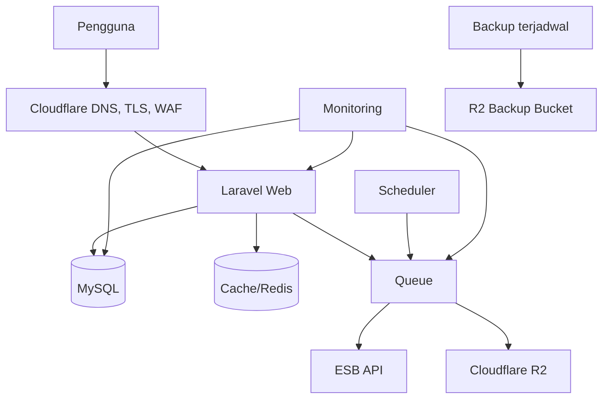

# PRD — Stabilitas, Performa, dan Skalabilitas Help Bloomery

## 1. Identitas dan status

| Field | Nilai |
| --- | --- |
| Tanggal baseline | 22 September 2026 |
| Status | Rancangan untuk review; belum mengotorisasi implementasi atau deployment |
| Sasaran | Aplikasi tetap tersedia, cepat, aman, dapat dipulihkan, dan mampu bertumbuh tanpa penulisan ulang besar |
| Stack baseline | Laravel 13, PHP 8.4, Filament 5, Livewire 4, Alpine.js 3, Tailwind CSS 4, Pest 4 |
| Infrastruktur baseline | cPanel shared hosting, Cloudflare proxy/DNS, attachment menggunakan Cloudflare R2 |
| Strategi | Stabilkan kondisi existing, ukur, optimalkan alur kritis, lalu migrasi infrastruktur berdasarkan bukti |

Dokumen ini menjadi acuan lintas pekerjaan untuk stabilitas dan skalabilitas. Kondisi repository, hosting, database, Cloudflare, serta kontrak ESB wajib diverifikasi kembali sebelum setiap phase. Instruksi user terbaru dan aturan repository tetap diprioritaskan.

Dokumen ini tidak dengan sendirinya memberi izin untuk mengubah DNS production, memindahkan server, menghapus data, menjalankan migration production, merotasi credential, atau mengirim transaksi ke ESB.

## 2. Ringkasan kondisi dan diagnosis awal

Pada 22 September 2026, `app.helpdesk-bloomery.com` sempat mengalami Cloudflare Error 520 dan 525. Data cPanel pada rentang kejadian menunjukkan CPU, physical memory, entry process, dan jumlah proses jauh di bawah limit serta tidak mencatat CloudLinux fault. Karena itu:

- Error 525 paling kuat mengarah ke TLS/SSL handshake antara Cloudflare dan origin hosting.
- Error 520 paling kuat mengarah ke origin mengirim respons kosong/tidak valid, koneksi terputus, restart web server, firewall, atau gangguan shared server.
- Traffic tinggi belum terbukti sebagai penyebab.
- Kode Laravel tidak menyebabkan 525 secara langsung, tetapi proses aplikasi yang berat dapat memperburuk kestabilan origin.
- Grafik cPanel per jam dapat menyembunyikan lonjakan singkat; log origin, Ray ID, dan Origin Analytics tetap diperlukan.

Risiko aplikasi yang sudah diketahui dari pengembangan existing:

1. Integrasi ESB dapat berada pada jalur request pengguna.
2. Beberapa halaman Livewire membawa state dan DOM yang besar, terutama Stock Card.
3. Aplikasi mencakup banyak domain bisnis dalam satu deployment.
4. Queue, scheduler, deployment, monitoring, backup, dan pemulihan belum menjadi satu sistem operasional yang terukur.
5. Shared hosting membatasi kontrol terhadap PHP worker, web server, firewall, Redis, Supervisor, dan log origin.

## 3. Tujuan

1. Insiden dapat dideteksi sebelum banyak pengguna melapor.
2. Kegagalan ESB tidak membuat seluruh aplikasi tidak dapat dipakai.
3. Request web tidak menjalankan proses berat yang cocok dikerjakan di background.
4. Halaman besar hanya memuat data yang sedang digunakan.
5. Deployment dapat diulang, diverifikasi, dan dipulihkan.
6. Backup berada di luar server utama dan pernah diuji restore.
7. Hak akses, cakupan cabang, audit trail, dan workflow existing tetap terjaga.
8. Keputusan pindah VPS atau platform managed dibuat berdasarkan metrik, bukan perkiraan.
9. API dan frontend terpisah dapat dikembangkan kelak tanpa menduplikasi logika bisnis.

## 4. Bukan tujuan

- Menulis ulang seluruh aplikasi dengan Vue, Astro, atau microservices.
- Memisahkan setiap modul menjadi deployment tersendiri.
- Mengganti formula SLA, scoring, QC, forecast, atau approval.
- Menghapus data historical atau attachment existing.
- Menganggap penambahan server sebagai pengganti optimasi kode.
- Menambahkan cache pada data sensitif tanpa aturan invalidasi dan isolasi user.

## 5. Prinsip keputusan

- **Ukur sebelum mengubah:** simpan baseline waktu respons, error, query, dan kapasitas.
- **Availability lebih dahulu:** selesaikan SSL/origin sebelum optimasi kosmetik.
- **Request web harus pendek:** pekerjaan lama masuk queue atau memakai snapshot.
- **Local-first untuk data referensi:** UI membaca database/cache, sinkronisasi eksternal berjalan terkontrol.
- **Idempotent:** retry tidak boleh menggandakan transaksi ESB atau record bisnis.
- **Modular monolith:** tetap satu Laravel, dengan batas domain yang jelas.
- **Perubahan bertahap:** satu alur kritis per phase, disertai test dan rollback.
- **Production aman secara default:** debug mati, credential tidak terekspos, akses minimal.

## 6. Arsitektur sasaran

### 6.1 Sasaran menengah

### 6.2 Pembagian tanggung jawab

| Lapisan | Tanggung jawab |
| --- | --- |
| Cloudflare | DNS, edge TLS, WAF, rate limit, bot protection, cache aset statis |
| Web Laravel | Autentikasi, otorisasi, validasi, response singkat, orchestration ringan |
| Action/Service | Proses bisnis reusable tanpa ketergantungan ke UI |
| Queue Job | ESB, export, notifikasi, sinkronisasi, dan proses berat |
| Database | Source of truth aplikasi dan snapshot integrasi |
| Cache | Data referensi/frequently-read dengan invalidasi yang jelas |
| R2 | Attachment dan backup terpisah bucket serta credential |
| Monitoring | Uptime, latency, error, queue, scheduler, backup, dan integrasi |

## 7. Roadmap pelaksanaan

### Phase 0 — Bekukan baseline dan inventaris

**Tujuan:** mengetahui kondisi aktual sebelum perubahan.

- Catat domain, document root, origin IP, mode SSL Cloudflare, PHP version, database, cron, queue, dan disk R2.
- Inventaris route kritis: login, launcher, request teknisi, Receiving, Stock Card, Sales Report, R&D, dan Item Journal.
- Inventaris seluruh pemanggilan ESB, timeout, retry, cache, dan side effect.
- Rekam baseline response time serta ukuran payload untuk route kritis.
- Catat ukuran database, tabel terbesar, inode, file log, failed job, dan waktu backup terakhir.
- Pastikan perubahan repository yang belum di-commit tidak tercampur dengan pekerjaan stabilisasi.

**Selesai jika:** tersedia baseline yang dapat dibandingkan, daftar risiko, dan urutan modul pilot.

### Phase 1 — Stabilisasi SSL dan origin shared hosting

**Tujuan:** menghentikan 520/525 yang berasal dari origin.

- Jalankan AutoSSL dan pastikan sertifikat mencakup semua hostname aktif.
- Gunakan Cloudflare SSL/TLS `Full (Strict)`.
- Audit record A/CNAME/AAAA dan hapus origin lama yang tidak valid.
- Uji origin memakai SNI dengan `openssl s_client` dan `curl --resolve`.
- Berikan waktu kejadian, URL, dan Ray ID kepada hosting untuk audit LiteSpeed/Apache, port 443, firewall, restart service, dan certificate chain.
- Pastikan Cloudflare IP ranges tidak diblokir atau dibatasi origin.
- Simpan prosedur insiden 520/525 dan jalur eskalasi hosting.

**Rollback:** perubahan DNS/SSL hanya dilakukan setelah nilai lama dicatat; jangan memakai Flexible sebagai solusi.

**Selesai jika:** tujuh hari tanpa 520/525 berulang dan handshake origin konsisten.

### Phase 2 — Fondasi operasional di cPanel

**Tujuan:** menjalankan production dengan konfigurasi dapat dipantau.

- Pastikan `APP_ENV=production`, `APP_DEBUG=false`, dan log production sesuai kebutuhan.
- Gunakan cron `schedule:run` setiap menit.
- Bila Supervisor tidak tersedia, jalankan queue dengan `--stop-when-empty` melalui cron; konfirmasi kebijakan hosting.
- Gunakan database queue/cache/session sampai Redis tersedia dan teruji.
- Atur daily log dengan retensi terbatas.
- Bersihkan backup lokal, cache usang, dan temporary file untuk menjaga inode.
- Buat health check read-only untuk aplikasi, database, scheduler, queue, R2, dan sinkronisasi terakhir.

**Selesai jika:** scheduler terdeteksi, job dapat diproses, failed job terlihat, dan health check tidak memaparkan rahasia.

### Phase 3 — Observability dan incident response

**Tujuan:** mengganti diagnosis berdasarkan dugaan dengan bukti.

- Pasang uptime check eksternal untuk domain utama.
- Catat p50/p95 response time, status 5xx, route lambat, dan error per modul.
- Catat durasi, status, correlation ID, dan endpoint untuk setiap request ESB tanpa credential/payload sensitif.
- Tambahkan metrik queue backlog, failed jobs, scheduler heartbeat, sinkronisasi terakhir, dan backup terakhir.
- Siapkan halaman `System Health` dengan permission administratif.
- Buat severity insiden, pemilik respons, template komunikasi, dan post-incident review.

**Target awal:** route biasa p95 < 2 detik; route data berat p95 < 5 detik; error 5xx < 0,5% di luar insiden eksternal.

### Phase 4 — Harden integrasi ESB

**Tujuan:** ESB lambat/gagal tidak menghabiskan web worker atau menggandakan transaksi.

- Terapkan connection timeout, request timeout, retry terbatas, dan exponential backoff.
- Bedakan operasi read-only yang aman di-retry dari create/update yang memerlukan idempotency.
- Simpan branch, purpose, location, product, category, dan transaction type sebagai cache/snapshot.
- UI membaca snapshot dan menampilkan waktu refresh terakhir.
- Refresh manual membuat job, bukan memblokir request browser.
- Simpan status `pending`, `processing`, `succeeded`, `failed`, error ringkas, jumlah percobaan, dan reference ESB.
- Jangan menyimpulkan timeout create sebagai pasti gagal; lakukan reconciliation berdasarkan reference/idempotency key.

**Pilot:** Stock Movement read-only dahulu, lalu Item Journal/Receiving setelah pola retry aman.

### Phase 5 — Optimasi Livewire dan halaman besar

**Tujuan:** payload, DOM, query, dan render tumbuh sesuai halaman aktif, bukan seluruh dataset.

- Ukur ukuran snapshot Livewire dan jumlah node DOM pada Stock Card Entry.
- Ganti seluruh `rows` besar menjadi kategori/page server-side.
- Simpan draft qty/catatan per kategori sebelum berpindah.
- Pertahankan indeks/identity produk sehingga input tidak tertukar.
- Terapkan database pagination pada index besar.
- Hindari query atau HTTP call dalam Blade dan computed property yang berubah terlalu sering.
- Gunakan debounce hanya ketika pencarian server-side dibutuhkan.
- Audit modal/detail agar data berat dimuat saat dibuka.

**Acceptance Stock Card:** perpindahan kategori mempertahankan draft; refresh browser memulihkan draft; submit tetap atomik sesuai workflow; payload tidak memuat seluruh katalog.

### Phase 6 — Database dan proses bisnis

**Tujuan:** query tetap cepat saat data historical bertambah.

- Temukan N+1, full table scan, query duplikat, dan aggregation berulang.
- Tambah indeks berdasarkan query nyata, terutama kombinasi branch, tanggal, status, foreign key, dan product code.
- Gunakan eager loading dan select kolom yang dibutuhkan.
- Pindahkan export besar, forecast, notifikasi massal, dan rekalkulasi ke queue.
- Gunakan chunk/cursor untuk proses besar.
- Tetapkan kebijakan retensi audit/log tanpa menghapus record bisnis yang wajib disimpan.
- Jalankan test regresi sebelum dan sesudah optimasi.

### Phase 7 — Deployment, backup, dan disaster recovery

**Tujuan:** rilis dan pemulihan dapat dilakukan berulang.

- Buat pipeline: test → build → artifact → backup → deploy → migrate → optimize → restart worker → health check.
- Pisahkan konfigurasi local, staging, dan production.
- Hindari build frontend berat di shared hosting; gunakan CI/artifact bila memungkinkan.
- Backup database otomatis ke bucket R2 khusus, terenkripsi, dan terpisah dari attachment.
- Retensi awal: 7 backup harian, 4 mingguan, 6 bulanan.
- Simpan inventory attachment R2 dan kebijakan versioning/lifecycle sesuai kebutuhan.
- Uji restore database dan file pada staging setiap 1–3 bulan.
- Dokumentasikan RPO, RTO, maintenance mode, rollback aplikasi, dan forward-fix migration.

**Target awal:** RPO 24 jam dan RTO 4 jam; perketat setelah latihan restore.

### Phase 8 — Migrasi ke VPS terkelola

**Trigger:** 520/525 tetap terjadi setelah origin diperbaiki; CloudLinux fault muncul berulang; p95 > 5 detik; queue terlambat; cron tidak andal; kebutuhan Redis/Supervisor/log origin tidak terpenuhi.

**Baseline server:** region Singapore, 2 vCPU, 4 GB RAM, 80 GB NVMe, backup otomatis. Gunakan pengelola seperti Laravel Forge bila tidak ada tim DevOps.

- Nginx, PHP-FPM, MySQL, Redis, Supervisor, cron, firewall, fail2ban, monitoring, dan backup.
- Mulai dengan satu server; load balancer baru digunakan setelah minimal dua web node diperlukan.
- Lakukan migration rehearsal di staging dengan salinan data yang dilindungi.
- Turunkan DNS TTL sebelum cutover.
- Freeze write singkat, final sync database, verifikasi count/checksum, cutover, smoke test, dan observasi.
- Pertahankan server lama read-only selama rollback window yang disepakati.

### Phase 9 — API dan frontend terpisah (opsional)

**Tujuan:** menyiapkan kanal Astro/Vue/mobile tanpa menduplikasi bisnis.

- Ekstrak proses bisnis ke Action/Service lebih dahulu.
- Buat API versioned dan Eloquent Resource.
- Mulai dari `/api/v1/me`, `/api/v1/launcher`, dan notifikasi ringkas.
- Launcher memakai satu bootstrap response, bukan request per tile.
- Gunakan Sanctum, CORS allowlist, CSRF, rate limit, dan audit token.
- Frontend statis dapat ditempatkan di Cloudflare Pages, tetapi API tetap harus stabil.
- Migrasikan modul secara bertahap; Stock Card/Receiving bukan pilot pertama.

Phase ini tidak diperlukan untuk menyelesaikan 520/525 dan bukan prasyarat migrasi VPS.

## 8. Keamanan minimum production

- Document root mengarah ke `public`; `.env` berada di luar public exposure dan tidak pernah masuk Git.
- Credential ESB/R2/database hanya di environment/secret manager dan dirotasi ketika terindikasi bocor.
- R2 token dibatasi per bucket dan permission minimum.
- Policy dan scope cabang berlaku di server, bukan hanya menyembunyikan tombol.
- Login, password reset, upload, export, dan endpoint mutation mendapat rate limit yang sesuai.
- Upload divalidasi MIME, ukuran, jumlah, dan visibility.
- Cloudflare cache hanya untuk aset statis; bypass halaman auth, Livewire, dan response personal.
- Audit dependency dan patch security dilakukan terjadwal.

## 9. Strategi test

- Unit test untuk kalkulasi dan transformasi domain.
- Feature/Livewire test untuk permission, scope cabang, state draft, pagination, dan workflow.
- Contract test dengan HTTP fake untuk ESB, termasuk timeout, retry, duplicate response, dan malformed response.
- Smoke test route kritis setelah deployment.
- Load test pada staging untuk login, launcher, Stock Card, refresh ESB, upload, dan export.
- Restore test untuk backup.
- Tidak ada test yang mengirim transaksi ke ESB production.

## 10. SLO dan indikator operasional

| Indikator | Target awal |
| --- | --- |
| Availability bulanan | ≥ 99,5% di luar maintenance terjadwal |
| Response p95 halaman biasa | < 2 detik |
| Response p95 halaman data berat | < 5 detik |
| Error aplikasi 5xx | < 0,5% |
| Queue backlog normal | < 5 menit |
| Scheduler heartbeat | Tidak terlambat > 2 menit |
| Backup database | Berhasil setiap hari |
| Restore drill | Minimal setiap 3 bulan |
| 520/525 | 0 kejadian berulang setelah origin dinyatakan sehat |
| Inode shared hosting | Jaga < 80% selama masih digunakan |

Target ditinjau setelah baseline nyata tersedia. Jangan mengubah target untuk menyembunyikan regresi.

## 11. Urutan modul implementasi

1. Infrastruktur, SSL, monitoring, queue, dan backup.
2. Stock Card sebagai pilot read-heavy dan Livewire state besar.
3. Item Journal sebagai pilot transaksi ESB.
4. Receiving sebagai workflow integrasi dan attachment kompleks.
5. Export R&D dan forecasting.
6. Sales Report, briefing, dan scheduler otomatis.
7. Modul lain berdasarkan metrik latency/error dan frekuensi penggunaan.

## 12. Risiko dan mitigasi

| Risiko | Mitigasi |
| --- | --- |
| Queue membuat transaksi ESB ganda | Idempotency key, reference mapping, reconciliation, test retry |
| Cache menampilkan data lama | TTL, timestamp refresh, invalidasi, tombol refresh terkontrol |
| Draft Stock Card hilang | Persist per kategori, unique constraint, autosave status, test reload |
| Migration mengunci tabel besar | Audit ukuran, staging rehearsal, maintenance window |
| Backup ada tetapi tidak dapat dipulihkan | Restore drill dan checksum |
| VPS menjadi single point of failure | Backup offsite, monitoring, documented rebuild; HA saat metrik menuntut |
| Pemisahan frontend menambah request | Endpoint bootstrap dan lazy loading, ukur network waterfall |
| Refactoring mengubah permission | Policy test, role matrix, branch-scope regression test |

## 13. Tata kelola perubahan

Setiap pekerjaan dari dokumen ini harus mempunyai:

1. Scope phase dan modul yang jelas.
2. Baseline/metrik sebelum perubahan.
3. Daftar file, database, permission, integrasi, dan route terdampak.
4. Test otomatis yang relevan.
5. Langkah deployment dan rollback.
6. Verifikasi staging.
7. Review hasil terhadap acceptance criteria.
8. Catatan operasional untuk support.

Hindari PR besar lintas phase. Perubahan struktur codebase mengikuti `docs/codebase-refactoring-prd.md`; perubahan visual mengikuti `docs/ui-consistency-prd.md`.

## 14. Definition of done program

Program dinyatakan matang ketika:

- SSL origin stabil dan tidak ada 520/525 berulang.
- Route kritis memenuhi target p95.
- Tidak ada request web yang menunggu pekerjaan ESB/export panjang tanpa alasan terdokumentasi.
- Stock Card tidak membawa seluruh katalog dalam satu state Livewire.
- Queue, scheduler, backup, dan health check terpantau.
- Restore database pernah berhasil di environment non-production.
- Deployment dapat diulang dengan health check dan rollback.
- Permission dan scope cabang memiliki regresi test.
- Tim mengetahui kapan dan bagaimana mengeskalasi insiden.
- Infrastruktur dapat dinaikkan kapasitasnya berdasarkan metrik yang tersedia.

## 15. Prompt penggunaan dokumen

Gunakan prompt berikut untuk pekerjaan lanjutan:

> Implementasikan Phase X dari `docs/application-stability-scalability-prd.md` untuk modul Y. Audit kondisi repository dan environment aktual terlebih dahulu. Pertahankan workflow, permission, scope cabang, data existing, dan kontrak ESB. Kerjakan hanya scope phase tersebut, tambahkan test yang relevan, jalankan verifikasi minimum, lalu laporkan perubahan, metrik sebelum/sesudah, risiko, serta langkah deployment dan rollback. Jangan deploy atau mengubah production tanpa instruksi eksplisit.

Untuk audit tanpa implementasi:

> Audit kesiapan Phase X dari `docs/application-stability-scalability-prd.md`. Jangan mengubah kode atau environment. Berikan gap, bukti file/config/log yang ditemukan, risiko, dependensi, urutan implementasi, dan acceptance criteria yang belum terpenuhi.
