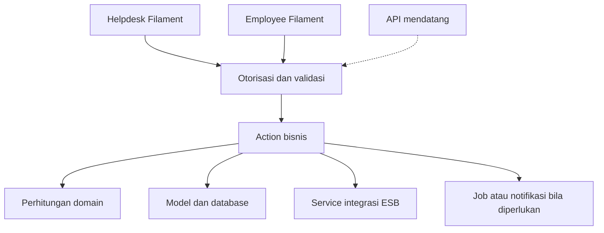
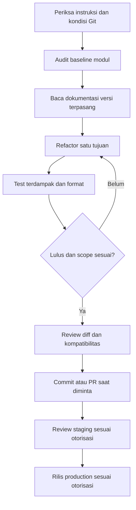

# PRD — Refactoring Codebase Help Bloomery

## 1. Identitas dan status

| Field | Nilai |
| --- | --- |
| Tanggal baseline dokumen | 17 September 2026 |
| Status | Rancangan; implementasi refactoring belum dimulai |
| Sasaran | Struktur lebih jelas, logika dapat digunakan bersama, dan perilaku existing tetap terjaga |
| Panel utama | Helpdesk untuk back office; Employee untuk aplikasi user |
| Modul Casual | Salah satu modul/tile Employee, bukan nama keseluruhan aplikasi user |
| Cara pelaksanaan | Bertahap per modul, dengan test dan review setiap phase |

Dokumen ini menjadi acuan scope refactoring. Status aktual repository wajib diperiksa pada awal pekerjaan; catatan baseline bukan jaminan kondisi terbaru. Instruksi user terbaru dan aturan repository tetap berlaku. Dokumen ini tidak mengizinkan deployment, penghapusan data, rotasi credential, atau penambahan dependency secara otomatis.

## 2. Latar belakang

Aplikasi berkembang dari fitur casual menjadi banyak modul operasional. Panel aplikasi user masih menggunakan namespace dan ID Casual. Sebagian halaman menangani UI sekaligus proses bisnis. Komponen reusable sudah tersedia, tetapi beberapa attachment, header, dan informasi form masih ditulis berulang.

Refactoring bertujuan menyediakan fondasi yang dapat dipakai halaman existing dan API di masa depan. Migrasi framework frontend bukan bagian perubahan ini.

## 3. Kondisi existing yang diketahui

- Backend Laravel 13, PHP 8.4 pada environment pengembangan, Filament 5, Livewire 4, Alpine.js 3, Tailwind CSS 4, dan Pest 4.
- Back office berada pada `app/Filament/Helpdesk`; aplikasi user pada `app/Filament/Casual`.
- Resource bersama juga ditemukan melalui `app/Filament/Resources`; audit kepemilikan sebelum memindahkannya.
- Sidebar Helpdesk menggunakan override `resources/views/vendor/filament-panels/components/layout/index.blade.php`. Label/resource Filament tidak otomatis menambahkan item sidebar.
- Sebagian navigasi teknisi dipusatkan di `app/Filament/Helpdesk/Navigation/HelpdeskNavigation.php`.
- Panduan panel tersedia di `docs/panels.md`, tetapi cocokkan informasi historisnya dengan provider dan route aktual.
- Komponen existing meliputi bottom navigation per modul, WhatsApp success card, dan R&D picker modal.
- API baru untuk seluruh Employee App belum merupakan hasil implementasi rancangan ini.
- User menyampaikan attachment menggunakan R2. Audit disk dan pemakaian aktual diperlukan; jangan mengasumsikan seluruh jenis attachment sudah memakai disk yang sama.
- Pada baseline terdapat perubahan Stock Card/Stock Movement belum di-commit, termasuk migration snapshot dan build assets. Perubahan tersebut merupakan pekerjaan fitur tersendiri, bukan refactoring ini.

## 4. Tujuan dan ukuran keberhasilan

1. Casual jelas menjadi modul di bawah Employee App.
2. Halaman/resource dikelompokkan menurut modul yang dimiliki.
3. Proses bisnis penting dapat dipanggil Helpdesk, Employee, dan API tanpa menyalin implementasi.
4. Pemeriksaan akses record dan cakupan cabang konsisten.
5. Integrasi ESB lebih mudah ditelusuri tanpa mengubah kontrak transaksi.
6. UI berulang menggunakan komponen existing atau komponen bersama yang relevan.
7. Route, workflow, data, hasil perhitungan, dan akses existing tetap sesuai baseline.

Keberhasilan dibuktikan oleh test terdampak, pemeriksaan route/discovery, dan review alur pengguna. Jumlah folder/class baru bukan ukuran keberhasilan.

## 5. Scope dan batasan

### Termasuk

- Audit dependensi halaman, resource, service, route, permission, view, dan navigasi.
- Ekstraksi proses bisnis terpilih ke action/service dengan tanggung jawab jelas.
- Pengelompokan lapisan Filament dan template khusus menurut modul.
- Konsolidasi komponen UI dengan perilaku yang memang sama.
- Pemisahan migrasi namespace/folder dari penggantian ID panel.
- Test regresi untuk akses dan proses penting.

### Tidak termasuk dalam refactoring inti

- Migrasi Vue, Inertia, Astro, atau penulisan ulang frontend.
- Pembuatan seluruh endpoint API.
- Pindah hosting/VPS, mengganti domain production, atau konfigurasi Cloudflare.
- Implementasi backup otomatis dan menu Backup Monitor.
- Penggantian bahasa/nama seluruh sidebar; tabel English pada bagian berikut adalah kandidat pekerjaan terpisah.
- Perubahan rumus SLA, KPI, QC, forecast, atau approval.
- Migrasi attachment R2, penghapusan file, perubahan database tanpa kebutuhan nyata.
- Penambahan dependency atau lapisan repository/DTO/event untuk setiap fungsi tanpa alasan.

Phase operasional/API di bagian roadmap adalah tindak lanjut dengan scope tersendiri. Jangan menyatakan PRD refactoring belum selesai hanya karena fitur tindak lanjut belum dibangun.

## 6. Struktur target

Gunakan pola modul yang sama pada kedua panel. Folder dibuat saat dibutuhkan, bukan seluruhnya sebagai placeholder.

```text
app/
├── Providers/Filament/
│   ├── HelpdeskPanelProvider.php
│   └── EmployeePanelProvider.php
├── Filament/
│   ├── Helpdesk/
│   │   ├── Pages/                     # Halaman bersama, misalnya dashboard
│   │   ├── Modules/{Module}/
│   │   │   ├── Pages/
│   │   │   ├── Resources/
│   │   │   └── Widgets/               # Jika diperlukan
│   │   ├── Concerns/
│   │   └── Navigation/
│   └── Employee/
│       ├── Pages/                     # Launcher, profil bersama, notifikasi
│       ├── Pages/Auth/                # Bila mengikuti konvensi auth existing
│       ├── Modules/{Module}/
│       │   ├── Pages/
│       │   └── Resources/
│       └── Concerns/                  # Jika diperlukan
├── Actions/{Module}/
├── Services/
│   ├── Esb/
│   └── {Domain}/
├── Models/
├── Policies/
├── Enums/
├── Jobs/
├── Notifications/
└── Http/
    ├── Controllers/
    ├── Requests/
    └── Resources/

resources/views/
├── components/                        # Komponen bersama dan khusus domain
├── filament/
│   ├── helpdesk/{module}/
│   └── employee/{module}/
└── exports/                           # Hanya jika sesuai konvensi aktual

tests/
├── Unit/
└── Feature/
```

Struktur resource Filament tetap mempertahankan `Pages`, `Schemas`, `Tables`, dan `RelationManagers` existing. Jangan membuat variasi `Modules/Technician` dan `Pages/Technician` untuk tujuan yang sama.

Discovery resource/page/widget pada folder baru harus diverifikasi berdasarkan dokumentasi Filament versi terpasang dan test route. Jangan mengasumsikan penemuan rekursif akan sesuai tanpa pengecekan.

`routes/casual.php` dapat menjadi `employee.php` pada phase rename, setelah menelusuri semua `require`. Jangan membuat `api.php` atau direktori API sebelum pekerjaan API dimulai.

## 7. Batas tanggung jawab

| Bagian | Tanggung jawab |
| --- | --- |
| Page/resource Filament | State form, presentasi, modal, validasi UI, feedback, dan pemanggilan proses |
| Action | Satu operasi bisnis bernama jelas, otorisasi yang diperlukan, koordinasi penyimpanan dan integrasi |
| Service | Perhitungan/kemampuan berulang atau komunikasi dengan sistem eksternal |
| Model | Relasi, cast, scope query yang relevan, dan perilaku data yang kohesif |
| Policy | Izin tindakan terhadap record; bukan hanya visibilitas tombol |
| Job | Proses background yang memang sesuai; retry harus aman |
| Komponen Blade | Presentasi reusable; tidak memuat credential atau menjalankan proses bisnis |
| Controller API mendatang | Validasi HTTP, pemanggilan proses bersama, dan format response |

Ekstraksi mempertahankan batas transaction dan urutan proses existing sampai ada pekerjaan khusus untuk memperbaikinya. Transaction database tidak dapat membatalkan transaksi yang sudah berhasil di ESB.

## 8. Pemetaan modul

| Modul kode | Cakupan |
| --- | --- |
| Casual | Tenaga casual, posisi, lowongan, absensi, lembur |
| Briefing | Checklist, kalender, penilaian, bobot, pengaturan |
| Driver | Perjalanan, rute, kendaraan, BBM, uang makan |
| Technician | Request perbaikan, maintenance, aset, QR, outsource |
| Erp | Request ERP/IT, jenis request, modul ERP, bulk data |
| Purchasing | Permintaan pembelian, sourcing, pemesanan material marketing |
| VendorCompliance | Insiden vendor dan scorecard; dapat berada dalam modul Purchasing untuk UI |
| Receiving | Penerimaan barang dan QC inbound |
| Inventory | Stock Card, lokasi, produk ESB, penerimaan material marketing |
| SalesReport | Laporan penjualan/shift dan review terkait |
| QualityControl | Audit, checklist QC, Item Journal |
| Rnd | Project, produk, BOM, shelf life, harga, forecast, CCP |
| BrandMarketing | Request desain/konten dan kategori |
| StoreSop | SOP dan konfirmasi pembacaan |
| Analytics | Analitik sales, promosi, persediaan |
| AccessManagement | Akun pengguna, role, permission |
| MasterData | Brand, cabang, karyawan, pengaturan bersama |

Modul kode tidak harus satu banding satu dengan grup sidebar. Satu resource tidak diduplikasi untuk ditampilkan di dua grup. Kepemilikan fitur yang ambigu diputuskan dari penggunaan existing dan dicatat dalam ringkasan perubahan.

## 9. Flow arsitektur



Halaman dan action tidak boleh bergantung pada controller API. Logika bersama tidak boleh mengharuskan konteks modal atau instance Livewire untuk dapat dipanggil.

## 10. Kontrak perilaku yang wajib dijaga

### Umum

- User tidak memperoleh izin baru akibat namespace atau folder berubah.
- Cakupan cabang mengikuti aturan existing, termasuk pengecualian administrator yang memang sudah berlaku.
- Route lama, URL scan QR, bookmark, redirect login, download, dan export tetap bekerja selama phase pemindahan.
- Nama model dan tabel Casual yang khusus data casual tidak diganti hanya karena nama panel berubah.
- Status, timestamp, approval history, dan data existing tidak direset.
- Attachment private tidak berubah menjadi publik.

### Stock Card

- Stock Movement memakai tanggal laporan; default laporan baru mengikuti kebijakan hari ini existing, bukan mengambil satu bulan.
- Company Code dan Branch Code berasal dari mapping Master Branch.
- Semua produk yang relevan dari hasil API tersedia tanpa batas kategori/WIP/jumlah yang pernah dihapus.
- Pagination tampilan tidak boleh memotong hasil sinkronisasi backend.
- Semua tipe transaksi hasil API tetap tersedia; daftar tipe dasar yang sudah dikonfigurasi dapat tampil nol.
- Qty utama dan qty Masuk/Keluar per tipe memiliki arti berbeda dan tidak dicampur.
- Qty staff, koreksi reviewer, saldo sistem, dan approval tetap berbeda.
- Rincian movement berada di detail, bukan ditambahkan kembali ke index.
- Refresh rincian hanya membaca/memperbarui tampilan; refresh saldo tersimpan mengikuti izin reviewer dan workflow existing.

### Receiving dan Item Journal

- Qty Accepted + Hold + Rejected harus sesuai qty fisik menurut aturan existing.
- Hanya Accepted dikirim ke ESB; kegagalan dokumen/cold chain/sampling/shelf life mengikuti validasi existing.
- Insiden vendor tidak dibuat berulang akibat refactoring/retry.
- Company Code harus dipilih sebelum master ESB dependent dapat digunakan sesuai flow Item Journal.
- Tidak ada pengiriman transaksi ESB production sebagai bagian test.
- Timeout tidak otomatis dianggap transaksi pasti gagal; perubahan mekanisme retry memerlukan scope khusus dan test duplikasi.

### Teknisi, SLA, R&D

- User membuat request tanpa menentukan jadwal; teknisi mengatur jadwal dan penanganan.
- Relasi QR/aset, riwayat perbaikan, status aset, outsource, dan verifikasi tetap mengikuti workflow existing.
- SLA mempertahankan weekdays pukul 08.00–17.00 serta konfigurasi zona waktu dan cakupan KPI existing; jangan menambah aturan hari libur tanpa permintaan.
- Forecast menguraikan WIP/BOM turunan sampai bahan dasar; item WIP unresolved tidak dianggap bahan baku secara diam-diam.
- Pemilihan BOM, konversi unit, tolerance, shelf life, dan format export tidak berubah tanpa pekerjaan terpisah.

## 11. Phase pelaksanaan

### Phase 1 — Audit dan baseline

**Pekerjaan:** inventaris route/panel/discovery, permission/sidebar, logika halaman, reusable UI, integrasi, disk attachment, dan test. Periksa `git status` dan bedakan perubahan fitur existing dari perubahan baru.

**Output:** baseline perilaku dan daftar file/dependensi modul pertama. Gunakan hasil audit untuk memilih test minimum yang bermakna.

**Exit criteria:** tidak ada perubahan existing yang ditimpa; route serta alur utama teridentifikasi; masalah yang sudah ada dipisahkan dari regresi baru.

### Phase 2 — Modul contoh: Teknisi

**Pekerjaan:** ekstrak proses yang jelas seperti membuat request atau mulai pengerjaan; konsistenkan akses record dan cabang; gunakan service existing jika sudah tepat. Pertahankan folder/ID panel selama ekstraksi awal.

**Output:** pola action/page/policy yang teruji untuk diikuti modul berikutnya.

**Exit criteria:** request manual/QR, penjadwalan, pengerjaan, outsource, maintenance, dan akses tidak mengalami regresi pada alur yang disentuh.

### Phase 3 — Komponen UI reusable

**Pekerjaan:** evaluasi komponen existing dahulu; ekstrak attachment, informasi pengisian, header, dan modal yang berulang. Parameterkan jenis file, batas, binding, dan handler tanpa menghilangkan perbedaan bisnis.

**Output:** komponen bersama yang benar-benar dipakai beberapa halaman.

**Exit criteria:** upload/hapus/validasi/loading tetap bekerja; tampilan tidak berubah tanpa kebutuhan; layout tidak membuat seluruh halaman overflow pada layar kecil.

### Phase 4 — Integrasi ESB

**Pekerjaan:** petakan reuse autentikasi saat ini, lalu konsistenkan token per company, pagination, timeout, format error, dan cache key. Pemindahan namespace terpisah dari perubahan perilaku jaringan.

**Output:** integrasi terstruktur dengan fixture/mock HTTP.

**Exit criteria:** token tidak bocor; cache tidak tercampur antar-company/cabang/tanggal/unit; pagination lengkap; kegagalan tidak menghasilkan sukses palsu atau data parsial tanpa informasi.

### Phase 5 — Proses bisnis modul lainnya

**Urutan:** Receiving/QC inbound → Item Journal → Stock Card → Sales Report → ERP/SLA → R&D → Purchasing/Brand Marketing/Briefing/SOP/Driver/Casual sesuai kompleksitas aktual.

**Pekerjaan:** satu alur yang kohesif per perubahan. Tidak memecah seluruh method menjadi class.

**Exit criteria per modul:** hasil perhitungan, akses, status, penyimpanan, dan integrasi tetap sesuai kontrak; test terdampak lulus.

### Phase 6 — Folder dan namespace per modul

**Pekerjaan:** kelompokkan Helpdesk dan aplikasi user menurut struktur Modules; perbarui import, discovery, explicit registration, Livewire reference, view, export, dan test. Namespace panel user dapat menjadi Employee, tetapi ID panel/route lama dipertahankan dahulu.

**Exit criteria:** resource ditemukan tepat satu kali; route tidak hilang/duplikat; URL lama tetap; sidebar kustom tetap mengikuti permission; profil tiap modul yang berbeda tidak disatukan tanpa audit.

### Phase 7 — Identitas panel Casual menjadi Employee

**Pekerjaan:** update provider, ID panel, referensi `filament.casual.*`, route file, login, redirect/intended URL, navigation, session terkait, service worker/PWA jika terdampak, dan test. Domain environment tidak otomatis diganti.

**Kompatibilitas:** buat pemetaan route lama ke baru bila diperlukan untuk URL eksternal; pembentukan link internal diperbarui ke route aktif. Alias/redirect tidak boleh membuka akses baru atau membuat redirect loop.

**Exit criteria:** login menuju launcher yang sesuai; QR/link lama tetap dapat digunakan; tidak ada referensi lama yang tidak disengaja; nama Casual hanya tersisa untuk domain casual atau kompatibilitas yang dijelaskan.

### Phase 8 — Tindak lanjut performa dan operasional

Scope tersendiri setelah baseline pengukuran: query/index, payload Livewire, cache, queue, monitoring, backup dan uji restore. Perubahan schema/infrastruktur tidak dibundel ke pemindahan folder.

### Phase 9 — Tindak lanjut API/frontend

Scope tersendiri: autentikasi, profil, launcher, satu modul percobaan. Pilihan Vue/Inertia atau API/frontend terpisah diputuskan saat pekerjaan dimulai, bukan dikunci oleh refactoring ini.

## 12. Flow pekerjaan dan rilis



Commit dipisahkan menurut tujuan. Pemindahan file, perubahan logika, rename panel, perubahan UI, dan fitur baru tidak dicampur jika dapat dipisahkan secara aman. Push tidak sama dengan deployment. Tag release menunjuk commit yang sudah diverifikasi.

## 13. Verifikasi dan acceptance criteria

- Baca dokumentasi melalui Boost sebelum perubahan kode, sesuai aturan repository.
- Gunakan test existing atau tambah test bermakna untuk perilaku/risiko yang disentuh.
- Mock HTTP ESB; jangan memakai credential production untuk test.
- Jalankan `php artisan test --compact` dengan file/filter terdampak.
- Jalankan `vendor/bin/pint --dirty --format agent` jika PHP berubah; review agar formatter tidak mengubah pekerjaan lain tanpa sengaja.
- Periksa `php artisan route:list` sebelum/sesudah perubahan discovery dan ID panel.
- Periksa kompilasi view/cache bila template/discovery berubah; build frontend bila aset sumber berubah.
- Uji sidebar untuk user berizin, tanpa izin, lintas cabang, dan akses route langsung.
- Review UI pada mobile kecil, tablet, desktop, landscape, zoom, dan nama/data panjang untuk halaman yang disentuh.
- Tidak menghapus test, data, attachment, dependency, atau fitur sebagai cara meluluskan refactoring.
- Tidak menampilkan `.env`, token, credential, atau backup sensitif dalam output pekerjaan.

### Definition of Done refactoring inti

- Phase 1–7 yang disepakati telah memenuhi exit criteria masing-masing.
- Modul yang ditunda dinyatakan eksplisit; tidak diklaim selesai seluruhnya.
- Route/permission/workflow tidak berubah secara tidak sengaja.
- Tidak ada resource ganda atau import/view reference rusak.
- Ringkasan perubahan mencatat yang berubah, test, risiko, dan langkah rilis/rollback yang relevan.
- Phase 8–9 tetap backlog terpisah kecuali user memperluas scope.

## 14. Risiko dan rollback

| Risiko | Pencegahan | Pemulihan |
| --- | --- | --- |
| Discovery/resource hilang | Bandingkan route dan test halaman | Revert commit struktur beserta konfigurasi discovery |
| Redirect login rusak | Test intended URL, launcher, domain | Kembalikan ID panel dan referensinya secara konsisten |
| Hak akses berubah | Test allowed/denied dan branch scope | Revert perubahan otorisasi; audit dampak |
| Transaksi ESB ganda | Mock, pertahankan kontrak, retry terkontrol | Rekonsiliasi ESB; revert kode tidak membatalkan transaksi |
| File tidak dapat dibuka | Audit disk/path dan test attachment | Kembalikan konfigurasi/path; jangan hapus file sumber |
| Aset browser lama | Build dan verifikasi PWA/cache deployment | Deploy kembali aset dan kode versi sebelumnya |

Refactoring murni sebaiknya tidak membutuhkan perubahan schema. Bila migration diperlukan, buat scope, backup, dan rencana kompatibilitas khusus. Jangan melakukan rollback database otomatis karena revert kode.

## 15. Aturan untuk AI pelaksana

1. Mulai dari phase aktif yang diminta, bukan menjalankan seluruh roadmap sekaligus.
2. Periksa Git dan baca instruksi/skill domain yang berlaku. Pertahankan pekerjaan user yang sudah ada.
3. Gunakan sibling file dan komponen existing sebagai referensi sebelum membuat abstraksi.
4. Bedakan pemindahan struktur dari perubahan perilaku. Jangan menyisipkan redesign, fitur, API, atau dependency baru.
5. Jangan membuat folder/class kosong untuk menyamai diagram.
6. Jangan mengganti nama tabel, model, permission, domain, atau ID panel sebelum phase yang mengaturnya.
7. Sidebar kustom diperbarui di definisi yang benar; icon mengikuti metode existing.
8. Otorisasi backend tetap berlaku meskipun tombol/menu tidak ditampilkan.
9. Jika menemukan bug unrelated, laporkan sebagai temuan dan lanjutkan scope yang aman; jangan memperluas pekerjaan diam-diam.
10. Laporkan bukti test dan keterbatasan. Jangan mengklaim audit penuh dari sampel beberapa file.
11. Commit, push, rilis, pesan eksternal, dan tindakan destruktif mengikuti otorisasi user; PRD bukan otorisasi tindakan tersebut.
12. Ketika melanjutkan setelah pergantian konteks, baca dokumen ini dan status pekerjaan terbaru; jangan mengulang phase yang sudah selesai.

## 16. Status pelaksanaan

| Phase | Status | Bukti/commit |
| --- | --- | --- |
| 1. Audit & Baseline | Belum dimulai | — |
| 2. Modul Teknisi | Belum dimulai | — |
| 3. Reusable UI | Belum dimulai | — |
| 4. Integrasi ESB | Belum dimulai | — |
| 5. Modul lain | Belum dimulai | — |
| 6. Struktur modul | Belum dimulai | — |
| 7. Rename panel | Belum dimulai | — |
| 8. Performa/operasional | Backlog terpisah | — |
| 9. API/frontend | Backlog terpisah | — |

Saat implementasi dimulai, catat phase aktif, modul selesai/ditunda, test, dan commit hanya jika pekerjaan dokumentasi status termasuk scope yang diminta.

## 17. Kandidat label sidebar English — ditunda

Status: **ditunda atas instruksi user pada 18 September 2026**. Lewati pekerjaan penggantian label sidebar English; pertahankan label menu existing. Bagian ini bukan Phase 17 dan tidak membatalkan Phase 1–9.

Daftar berikut tetap disimpan sebagai referensi percakapan, bukan instruksi implementasi. Penggantian label hanya dilanjutkan jika user meminta secara eksplisit.

| Group | Submenus |
| --- | --- |
| Casual Workforce | Casual Staff, Job Positions, Job Openings, Attendance, Overtime Requests |
| Daily Briefing | Checklist Results, Briefing Calendar, Briefing Checklist, Briefing Scores, Scoring Weights, Briefing Settings |
| Transportation | Trip Monitoring, Trip Routes, Vehicles, Fuel Types, Driver Meal Allowance, Trip Settings |
| Maintenance & Assets | Service Requests, Maintenance Summary, Maintenance Checklist, Asset Registry, Maintenance Settings |
| IT & ERP | ERP & IT Requests, ERP Modules, Request Types, Bulk Data Requests |
| Store Operations | Store SOPs, SOP Categories |
| Research & Development | Development Projects, Product Shelf Life, Product Price Index, Prefix Categories, Prefix Names |
| Purchasing | Vendor Compliance, Purchase Requests, Material Sourcing, Marketing Material Orders |
| Quality Control | QC Audits, QC Checklist, Item Journal |
| Inventory | Stock Cards, Receiving, Storage Locations, Location Types, ESB Products, Marketing Material Receipts |
| Finance | Sales Reports, Compliment Types, Basket Size |
| Sales Planning | Sales Projections |
| Analytics | Sales Analytics, Promotion Analytics, Inventory Analytics |
| Brand & Marketing | Design Requests, Design Categories, Content Requests |
| Access Management | User Accounts, Roles & Permissions |
| Master Data | Brands, Branches, Employees, WhatsApp Settings |

Menu baru `System Administration → Backup Monitor` dibangun hanya dalam pekerjaan backup otomatis tersendiri; tidak dianggap sudah tersedia.
